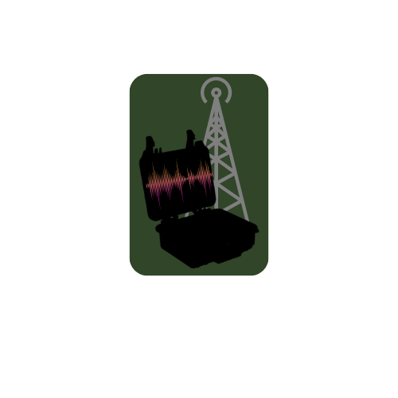

<!-- Improved compatibility of back to top link: See: https://github.com/othneildrew/Best-README-Template/pull/73 -->
<a name="readme-top"></a>


<!-- PROJECT SHIELDS -->
<!--
*** I'm using markdown "reference style" links for readability.
*** Reference links are enclosed in brackets [ ] instead of parentheses ( ).
*** See the bottom of this document for the declaration of the reference variables
*** for contributors-url, forks-url, etc. This is an optional, concise syntax you may use.
*** https://www.markdownguide.org/basic-syntax/#reference-style-links
-->
[![Contributors][contributors-shield]][contributors-url]
[![Forks][forks-shield]][forks-url]
[![Stargazers][stars-shield]][stars-url]
[![Issues][issues-shield]][issues-url]
[![MIT License][license-shield]][license-url]


<!-- PROJECT LOGO -->
<br />
<div align="center">
  <a href="https://github.com/JFisch25200/RPI-CyberDeck">
    
  </a>

<h3 align="center">RPI-CyberDeck</h3>

  <p align="center">
    RTL-SDR Based CyberDeck
    <br />
    <a href="https://github.com/JFisch25200/RPI-CyberDeck"><strong>Explore the docs »</strong></a>
    <br />
    <br />
    <a href="https://github.com/JFisch25200/RPI-CyberDeck">View Demo</a>
    ·
    <a href="https://github.com/JFisch25200/RPI-CyberDeck/issues/new?labels=bug&template=bug-report---.md">Report Bug</a>
    ·
    <a href="https://github.com/JFisch25200/RPI-CyberDeck/issues/new?labels=enhancement&template=feature-request---.md">Request Feature</a>
  </p>
</div>


<!-- TABLE OF CONTENTS -->
<details>
  <summary>Table of Contents</summary>
  <ol>
    <li>
      <a href="#about-the-project">About The Project</a>
      <ul>
        <li><a href="#built-with">Built With</a></li>
      </ul>
    </li>
    <li>
      <a href="#getting-started">Getting Started</a>
      <ul>
        <li><a href="#prerequisites">Prerequisites</a></li>
        <li><a href="#installation">Installation</a></li>
      </ul>
    </li>
    <li><a href="#usage">Usage</a></li>
    <li><a href="#roadmap">Roadmap</a></li>
    <li><a href="#contributing">Contributing</a></li>
    <li><a href="#license">License</a></li>
    <li><a href="#contact">Contact</a></li>
    <li><a href="#acknowledgments">Acknowledgments</a></li>
  </ol>
</details>


<!-- ABOUT THE PROJECT -->
## About The Project

[![Product Name Screen Shot][product-screenshot1]](https://github.com/JFisch25200/RPI-CyberDeck)


<p align="right">(<a href="#readme-top">back to top</a>)</p>


### Built With
* [![BASH][bash]][bash-url]
* [![SDRPP][sdrpp]][sdrpp-url]
* [![OPENSSH][openssh]][openssh-url]
* [![XRDP][xrdp]][xrdp-url]
* [![CMAKE][cmake]][cmake-url]

<p align="right">(<a href="#readme-top">back to top</a>)</p>


<!-- GETTING STARTED -->
## Getting Started

This is not a seemless installation process. Read error messages and react accordingly.

### Prerequisites
* [![Apache Case]][hardware-case1]
* Pelican Case [hardware-case2]
* Raspberry Pi [hardware-rpi]
* RTL-SDR [hardware-radio]
* USB Dongle [hardware-usb]
* External Batery [hardware-power]

* SDR++ Software [software-sdrpp]
* OpenSSH [openssh-url]
   ```sh
   sudo apt install openssh
   ```
* cmake [cmake-url]
   ```sh
   sudo apt install cmake
   ```
* XRDP [xrdp-url]
   ```sh
   sudo apt install xrdp
   ```

### Installation

1. Set up Raspberry Pi SD Card with an appropriate OS. https://www.raspberrypi.com/software/
2. Before ejecting the SD card, place an empty file titled SSH in the root directory, this will ensure that SSH is enabled.
3. During initial setup as always, run:
   ```sh
   sudo apt-get update && sudo apt-get upgrade
   ```
4. Install requirements:
   ```sh
	sudo apt install cmake xrdp libfftw3-dev libglfw3-dev libvolk2-dev libsoapysdr-dev libairspyhf-dev libiio-dev libad9361-dev librtaudio-dev libhackrf-dev libzstd1 libzstd-dev libairspy-dev librtlsdr-dev
	```
5. Process to build SDRPlusPlus:
   ```sh
   cd ~; mkdir tmp; cd tmp
   unzip ~/SDRPlusPlus-master.zip ~/tmp/
   cd SDRPlusPlus-Master
   mkdir build; cd build
   cmake ..
   ```
6. If there are any package errors:
   ```sh
   sudo apt search <package that was not found>
   sudo apt install <not installed package from search>
   ```
7. Continuation of SDRPlusPlus Build:
   ```sh
   make -j5
   sudo make install 
   cp -pv sdrpp /bin/
   ```
8. To run SDR++ from CLI:
   ```sh
   sdrpp
   ```
9. In order for CLI run to work on a remote session, XRDP, VNC, etc.:
   ```sh
   export DISPLAY=localhost:0.0
   ```
10. Google is your friend.

<p align="right">(<a href="#readme-top">back to top</a>)</p>


<!-- USAGE EXAMPLES -->
## Usage

Use this space to show useful examples of how a project can be used. Additional screenshots, code examples and demos work well in this space. You may also link to more resources.
[![Product Name Screen Shot][product-screenshot2]](https://github.com/JFisch25200/RPI-CyberDeck)
[![Product Name Screen Shot][product-screenshot3]](https://github.com/JFisch25200/RPI-CyberDeck)
_For more examples, please refer to the [Documentation](https://github.com/JFisch25200/RPI-CyberDeck/blob/main/Docs/SDRPP-manual.pdf)_

<p align="right">(<a href="#readme-top">back to top</a>)</p>


<!-- ROADMAP -->
## Roadmap

- [X] Create Portable Raspberry Pi with RTL-SDR Capability
- [ ] Get it to function properly


See the [open issues](https://github.com/JFisch25200/RPI-CyberDeck/issues) for a full list of proposed features (and known issues).

<p align="right">(<a href="#readme-top">back to top</a>)</p>


<!-- CONTRIBUTING -->
## Contributing

Contributions are what make the open source community such an amazing place to learn, inspire, and create. Any contributions you make are **greatly appreciated**.

If you have a suggestion that would make this better, please fork the repo and create a pull request. You can also simply open an issue with the tag "enhancement".
Don't forget to give the project a star! Thanks again!

1. Fork the Project
2. Create your Feature Branch (`git checkout -b feature/AmazingFeature`)
3. Commit your Changes (`git commit -m 'Add some AmazingFeature'`)
4. Push to the Branch (`git push origin feature/AmazingFeature`)
5. Open a Pull Request

<p align="right">(<a href="#readme-top">back to top</a>)</p>


<!-- LICENSE -->
## License

Distributed under the MIT License. See `LICENSE.txt` for more information.

<p align="right">(<a href="#readme-top">back to top</a>)</p>


<!-- CONTACT -->
## Contact


Project Link: [https://github.com/JFisch25200/RPI-CyberDeck](https://github.com/JFisch25200/RPI-CyberDeck)

<p align="right">(<a href="#readme-top">back to top</a>)</p>


<!-- ACKNOWLEDGMENTS -->
## Acknowledgments

* []()
* []()
* []()

<p align="right">(<a href="#readme-top">back to top</a>)</p>


<!-- MARKDOWN LINKS & Images -->
<!-- https://www.markdownguide.org/basic-syntax/#reference-style-links -->
[contributors-shield]: https://img.shields.io/github/contributors/JFisch25200/RPI-CyberDeck.svg?style=for-the-badge
[contributors-url]: https://github.com/JFisch25200/RPI-CyberDeck/graphs/contributors
[forks-shield]: https://img.shields.io/github/forks/JFisch25200/RPI-CyberDeck.svg?style=for-the-badge
[forks-url]: https://github.com/JFisch25200/RPI-CyberDeck/network/members
[stars-shield]: https://img.shields.io/github/stars/JFisch25200/RPI-CyberDeck.svg?style=for-the-badge
[stars-url]: https://github.com/JFisch25200/RPI-CyberDeck/stargazers
[issues-shield]: https://img.shields.io/github/issues/JFisch25200/RPI-CyberDeck.svg?style=for-the-badge
[issues-url]: https://github.com/JFisch25200/RPI-CyberDeck/issues
[license-shield]: https://img.shields.io/github/license/JFisch25200/RPI-CyberDeck.svg?style=for-the-badge
[license-url]: https://github.com/JFisch25200/RPI-CyberDeck/blob/master/LICENSE.txt
[product-screenshot1]: Images/screenshot.jpg
[product-screenshot2]: Images/CyberDeckinLightSnow.jpg
[product-screenshot3]: Images/cmake-sdrpp.png
[bash]: https://shields.io/badge/bash-000000?style=for-the-badge&logo=bash&logoColor=white
[bash-url]: https://www.gnu.org/software/bash/
[sdrpp]: https://shields.io/badge/SDR++-000000?style=for-the-badge&logo=SDR++&logoColor=white
[sdrpp-url]: https://www.sdrpp.org/
[openssh]: https://shields.io/badge/openssh-000000?style=for-the-badge&logo=openssh&logoColor=white
[openssh-url]: https://www.openssh.com/
[xrdp]: https://shields.io/badge/xrdp-000000?style=for-the-badge&logo=xrdp&logoColor=white
[xrdp-url]: https://www.xrdp.org/
[cmake]: https://shields.io/badge/cmake-000000?style=for-the-badge&logo=cmake&logoColor=white
[cmake-url]: https://cmake.org/download
[hardware-case1]: https://www.harborfreight.com/1800-weatherproof-protective-case-small-black-64550.html
[hardware-case2]: https://www.pelican.com/us/en/product/cases/protector/1200
[hardware-rpi]: https://www.raspberrypi.com/products/raspberry-pi-4-model-b/
[hardware-radio]: https://www.amazon.com/RTL-SDR-Blog-RTL2832U-Software-Defined/dp/B0CD7558GT/
[hardware-usb]: https://www.amazon.com/Targus-4-Port-USB-3-0-ACH124US/dp/B00P937GQ4
[hardware-power]: https://www.aukey.com/products/aukey-pb-n93a-usb-c-power-bank-20000mah-pd-ultra-slim-power-bank-with-18w-pd
[software-sdrpp]: https://github.com/AlexandreRouma/SDRPlusPlus/archive/refs/heads/master.zip
